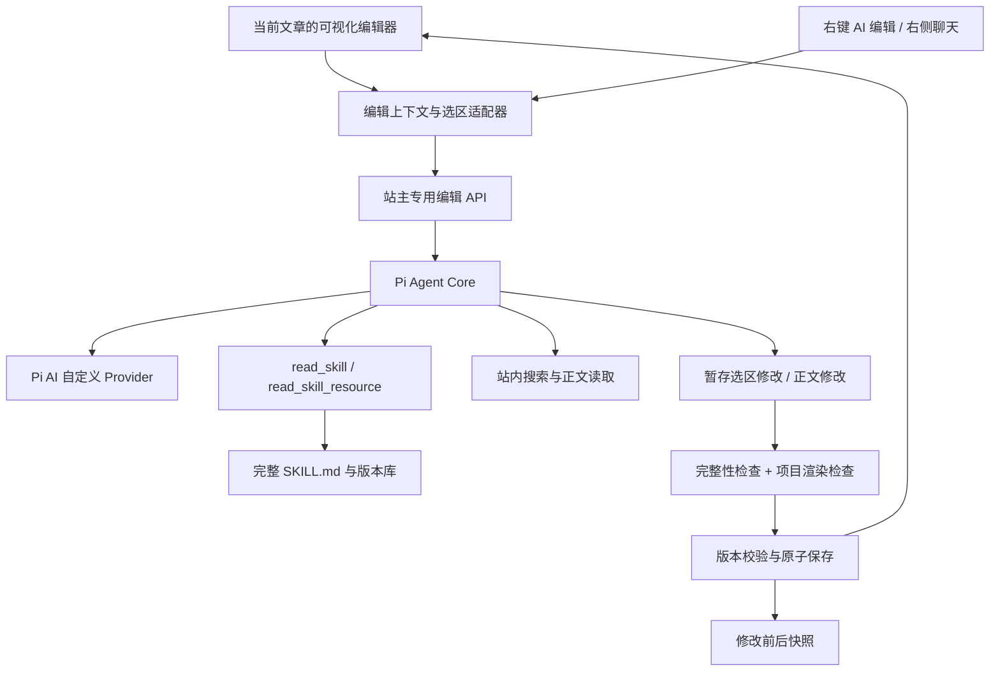

# AI 文章编辑：技术调研与设计

日期：2026-10-08。本文是拟实施设计，不代表接口已经可用。

## 1. Pi 技术选择

### 1.1 采用的层次

- `@earendil-works/pi-ai`：统一模型访问。
- `@earendil-works/pi-agent-core`：执行站点定义的工具并衔接多轮请求。
- 站点自己的技能注册器、数据库读写和编辑器桥接：提供文章与技能领域能力。

Pi AI 支持自定义服务商；Pi Agent Core 提供工具执行和事件机制。这些是接入基础，文章权限、技能加载和修改事务由本项目实现。[Pi AI](https://github.com/earendil-works/pi/blob/main/packages/ai/README.md)、[Agent Core](https://github.com/earendil-works/pi/blob/main/packages/agent/README.md)

不嵌入完整的终端 Coding Agent。网站不需要终端、通用 `bash` 或文件系统写工具；文章正文在数据库中。

截至本次查询，npm 最新发布版本与仓库包信息为 `1.0.4`，两个包要求 Node `>=22.19.0`。开发时采用相同精确版本并锁定依赖，不能拿旧版示例直接拼接新版 API。[AI 包声明](https://github.com/earendil-works/pi/blob/main/packages/ai/package.json)、[Agent 包声明](https://github.com/earendil-works/pi/blob/main/packages/agent/package.json)

### 1.2 运行环境

- 当前本机 Node 是 24.19.0，满足包声明。
- 项目 Electron 依赖声明为 44.3.0 系列；打包后仍需核对实际内置 Node 版本。
- Android 本地服务构建脚本使用 Node 24 系列，但原生 Android UI 另有编辑与接口适配工作。
- 网页部署采用 Vercel 适配器；Node 版本和请求时长限制要在部署阶段核对实际配置。
- Pi 只运行在服务端；前端不打包模型 SDK，不接收 API Key。

### 1.3 当前服务商映射

使用 `createModels`、`createProvider` 和 `openAICompletionsApi` 创建自定义 Provider，沿用设置内的服务商地址、密钥和模型 ID。这里的模型 ID 是中转平台提供的名称，不强行映射为 Pi 内置 DeepSeek 模型目录。

Pi 配置使用 API 根地址，例如现有 `/v1`；不要把旧 `buildChatUrl()` 拼出的 `/chat/completions` 当成 SDK 根地址。历史配置若填写完整 endpoint，要先归一化。

迁移检查重点：`system`/`developer` 角色、`max_tokens` 字段、流式 usage、工具参数格式以及完成原因。未知中转地址不能依赖 Pi 对官方域名的自动识别；先显式设置保守兼容项，再根据真实请求结果调整。

同一 Provider Adapter 供普通聊天、记忆摘要、日记生成和文章编辑使用。分别保留各自提示词、访问策略、输出格式和预算；所有调用逐步迁移完成后由 Pi 统一发起请求，不留四份独立的网络实现。

普通聊天对外 SSE 格式仍保持已有 `delta/meta/done/error`，避免前端升级时影响现有聊天和记忆。

## 2. 组件关系



工具在任务内产生候选稿；数据库正式保存是独立、确定性的提交步骤。Agent 不能凭一个工具调用直接绕过编辑器版本检查。

## 3. 编辑上下文桥接

新增 `src/lib/ai-editor-context.ts`，由 `DocInlineEditor.tsx` 在打开编辑时注册，在关闭、切换节点、路由替换和组件卸载时解除注册。

建议上下文结构：

```ts
interface AiEditorSnapshot {
  editorSessionId: string;
  target: { kind: 'article' | 'doc-node'; id: string };
  title: string;
  source: string;             // 当前根编辑器源码
  sourceHash: string;
  localRevision: number;
  persistedVersion: string;  // 最后一次已确认保存版本
  selection?: SelectionTarget;
}
```

提供 `captureSnapshot()`、`captureSelection()`、`flushPendingInput()`、`flushSaveQueue()`、`applyCommittedChange()`、`undoAiChange()`、`subscribe()`。它们通过编辑器句柄工作，不使用正文 DOM `textContent` 作为 Markdown 源码。

右侧 AI 打开时获取当前上下文；非编辑模式没有写入能力。会话按 `target.kind + target.id + editorSessionId` 分区，不能继续使用一个全局聊天 ID 跨文章写入。

### 3.1 选区与嵌套编辑器

扩展 `MarkdownContextMenu` 的动作回调，在已有菜单内加入「使用 AI 编辑」。不另加全局捕获监听抢占现有菜单。

CodeMirror 选区来自实例的 `state.selection`，不能使用浏览器 `window.getSelection()` 替代。调用时立即捕获，聊天框获得焦点后仍能定位原选区。

Callout、分栏和指令面板采用子编辑器；`rootEditor()`/`columnTarget()` 已解决部分焦点归属，但当前没有通用的子选区到根源码映射。需补充容器适配器：

- 普通正文：根源码区间。
- Callout：根容器锚点、引用深度、子正文区间；回写恢复 `>` 前缀。
- 分栏 / 指令面板：根容器锚点、面板编号、子正文区间；回写保留分隔符与围栏。
- 表格：单元格内的 DOM 选区先交给表格适配器；强制刷出当前 300ms 防抖输入，再序列化，保留列数、对齐行和 `\|` 转义。

保存选区的逻辑内容、容器路径、原文指纹和根版本；不能只保存一个会在失焦后销毁的 `EditorView` 对象。多选区跨不同容器第一版给出明确提示，不猜测合并。

局部修改只允许替换用户选中的逻辑内容；必要的引用前缀和单元格转义由适配器完成，选区外语义不得变化。局部上下文可展示整篇提纲、邻近段落，并按需读取当前全文。

## 4. Agent 工具

| 工具 | 作用 | 约束 |
| --- | --- | --- |
| `read_current_document` | 读取本轮冻结的当前源码或指定章节 | 当前稿优先于数据库旧稿，返回版本和覆盖范围 |
| `search_site_content` | 搜索文章、文档 | 只返回站主有权访问的内容，限制条数和片段长度 |
| `read_site_document` | 根据结果 ID 读取正文 | 只读，可按章节或范围读取；返回来源链接 |
| `read_skill` | 读取技能完整 `SKILL.md` | 校验启用状态，固定版本，返回文件内容与指纹 |
| `read_skill_resource` | 读取技能引用的文本资源 | 只能访问该技能包内已登记的相对路径 |
| `ask_user` | 处理笔记类型不明等必要澄清 | 转成聊天内的问题；不占住一个长期运行请求 |
| `replace_selection` | 产生选区替换候选 | 仅选区模式，目标由服务器绑定 |
| `edit_current_document` | 暂存对当前稿的补丁或整篇替换 | 仅当前目标，操作需匹配本轮版本 |
| `validate_markdown` | 检查本轮完整候选 | 使用项目规范与渲染器，返回可修复问题 |

模型不能指定任意写入目标 ID、数据库表、文件路径或 SQL。服务器从任务绑定的上下文确定写入对象。

当使用笔记技能时，修改工具的执行前置条件是本轮已成功加载相应技能版本。首次技能链必须可观察：`note-normalizer → my-blog-structured-notes`；没有加载记录不能声称「按技能完成」。

阅读工具按需调用，写入工具顺序执行。Agent 工具返回「候选已更新」，只有正式保存确认之后 UI 才显示「已保存」。

## 5. 正式保存与版本保护

### 5.1 单轮处理

1. 刷出表格等部件未同步的输入，读取根稿。
2. 顺序清空旧自动保存队列，取得数据库版本；若编辑器在此过程中又变化，重新捕获。
3. 冻结本轮 `sourceHash`、目标和技能版本，发起 Agent 请求。
4. 修改工具只操作本轮候选稿；多次工具操作在同一个候选中衔接。
5. 完整生成后执行内容和渲染校验，保存可恢复候选并发送 `ready`。
6. 客户端检查当前文章、编辑会话、根源码指纹仍一致；变化则标记冲突。
7. 获得短暂的应用锁：暂停自动保存队列和新输入，确认没有在途手工保存，再调用提交接口。
8. 服务端以原稿版本条件更新正文，并在同一事务写入修改前后快照。文章原有 `published` 和其他属性保持其最新值。
9. 返回正式保存版本后，客户端用一次隔离历史的 CodeMirror 事务更新正文；此事务不再次触发重复保存，刷新目录并释放锁。
10. 显示成功状态、改动对比与撤销入口。

应用锁只覆盖提交与本地应用，不覆盖模型生成全过程。提交超时或响应丢失时，通过任务状态查询确定是否已经保存，不能盲目重复应用或假设未保存。

### 5.2 对现有保存路径的必要调整

现有文章 PATCH 显式设置 `published: true`；文档 PATCH 对过长正文使用 `slice()`。AI 提交不能直接沿用这两种行为：必须保留发布状态，超限整单拒绝而非静默截断。

抽出文章/文档通用的正文保存服务，增加 `expectedVersion`/`expectedContentHash` 条件及明确的 409 冲突。当前编辑会话中的手工自动保存也使用版本化队列，旧的迟到保存不能覆盖 AI 结果。

SQLite 使用事务与条件更新；PostgreSQL 使用事务和条件更新/行锁。跨设备写入和同步冲突继续保留冲突副本。生成接口不向客户端授予其他文章的写权限。

### 5.3 撤销和恢复

同页撤销采用根编辑器的独立历史事务，子编辑器不建立一套无法回退根内容的 AI 历史。撤销动作进入正常的版本化保存队列。

持久恢复以「当前内容仍与待恢复版本匹配」为条件。若用户又修改过文章，则保留恢复候选，让用户选择，不能直接回到很早的整篇内容。

## 6. 建议接口

| 接口 | 用途 |
| --- | --- |
| `POST /api/ai/edit/turn` | 当前文章或选区的问答、编辑请求，SSE |
| `POST /api/ai/edit/commit` | 提交服务器已校验的候选，版本比较、原子保存 |
| `GET /api/ai/edit/runs/:id` | 请求中断后的结果和提交状态查询 |
| `POST /api/ai/edit/runs/:id/restore` | 有版本条件的历史恢复 |
| `GET /api/ai/skills` | 技能元信息和启用状态 |
| `GET /api/ai/skills/:id` | 完整技能包或指定文件 |
| `PUT /api/ai/skills/:id` | 带基准版本保存完整技能文件 |
| `POST /api/ai/skills/import` | 校验后导入完整技能包 |
| `GET /api/ai/skills/:id/export` | 导出当前技能及关联文本文件 |
| `POST /api/ai/skills/:id/restore` | 恢复技能版本 |

上述路径是设计名称，开发时统一实现。每个 handler 内校验站主身份，并加入 `route-permissions.ts`；响应使用 `private, no-store`。

SSE 事件建议：`context`、`text_delta`、`skill_loaded`、`source_read`、`tool_status`、`needs_input`、`ready`、`error`、`done`。聊天文本与编辑候选分开，普通回复不会被误当成文章内容。

提交仅接受 `runId`、候选指纹、编辑会话和基准版本，服务器读取自己保存的候选；不信任客户端重新传来的任意正文。幂等键避免请求重试时生成重复历史或重复写入。

## 7. 数据与技能存储

### 7.1 文章修改记录

新增 `ai_edit_runs`：目标、状态、幂等键、基准版本、原稿指纹、候选指纹、修改前后正文、补丁、技能版本、来源摘要、提交版本和时间。记录实际 token 用量；缺少 usage 时标记未知，不把 0 当真实价格。

任务运行状态绑定服务端实例，不跨设备同步；文章正文仍参与现有同步。修改记录首版在执行所在站点恢复，`src/sync/tables.ts` 明确列为 `skip`。设置按篇历史条数/大小上限，不清理正在生成、等待澄清或尚未提交的候选。

### 7.2 完整技能包

- `ai_skills`：技能 ID、名称、启用状态和当前版本指针。
- `ai_skill_versions`：不可变版本，保留完整 `SKILL.md`、关联文本资源、包指纹、父版本和时间。
- 项目资源中携带两个原始技能包，作为首装默认值；有效版本由运行时技能库读取。

技能注册器实现两个存储适配器：

- `ManagedSkillStore`：网页和桌面都可以在设置中编辑原始文件内容。数据库存储完整技能文件和资源，提供虚拟的 `技能目录/SKILL.md` 读取语义。
- `DirectorySkillStore`：桌面在设置选定本机技能目录，只挂载登记的两个技能包。每个新任务重新读取原文件、计算包指纹，直接反映本机文件修改；任务内保留不可变内容快照。

模型通过相同的 `read_skill`/`read_skill_resource` 读完整文件，而非调用写死的整理函数。每个技能的有效来源唯一；本机挂载为只读，站内修改使用管理模式。源目录缺失时明确报错，不偷偷切到一份可能过期的默认技能。

本机目录选择复用受限桌面文件夹选择能力，必要时只新增用途明确的 preload 方法；不暴露通用文件系统 IPC。路径保存在桌面本机配置，网页不显示此控件，不尝试读取浏览器用户电脑路径。读取前校验解析后的真实路径仍位于登记技能根目录，避免符号链接和相对路径越界。

管理模式的技能保存采用基准版本条件；版本记录只追加，恢复通过切换指针完成。SQLite、PostgreSQL 两套 schema、部署迁移和同步登记必须同时补齐。管理模式技能版本可参与同步；技能头指针同步遇到并发分叉时保留两份版本并标记待选择，不简单用 LWW 静默替换。本机挂载快照属于本地来源，仅用于任务重现，不同步路径和外部文件内容。

版本记录包含 `sourceKind`；同步对本机挂载快照使用明确的行过滤，避免其因与管理版本共表而意外上传。头指针的分叉需使用专门的冲突解析，不直接复用普通设置项的最后写入规则。

## 8. 长文、用量与失败处理

- 普通聊天继续采用现有预算；文章编辑采用单独预算，建议初值 8,192 输出 tokens，最终不得超过当前服务商验证的上限。
- 当前模型上下文窗口尚未核实，设置需支持编辑模型和上下文预算，不能伪造一个巨大 `contextWindow` 来绕过限制。
- 每个任务初始上限：8 次模型请求、24 次工具调用、2 次语法修复；这些是应用预算，不是 Pi 默认值。
- 检索默认每次 8 条命中、每条约 300 字摘要；读取正文按需要进一步展开。
- 不套用普通聊天的 4,000 字消息裁剪到文章和技能工具结果；使用独立上下文预算，并显示已读取范围。
- 超预算时按完整章节、Callout、表格、代码块和公式块划分；不能按固定字符数切开围栏或公式。
- 整篇任务先建立章节清单，逐块整理，再生成全局索引并核对覆盖清单；所有块完成后一次提交，不逐块覆盖正式原稿。
- 技能和原文超出预算时明确说明并转为分块，不能悄悄截断技能规则或原文。
- 状态为输出长度耗尽、错误、取消或未完整结束时一律不提交。Pi 完成原因由 Adapter 归一化处理。[Pi 消息类型](https://github.com/earendil-works/pi/blob/main/packages/ai/src/types.ts)
- 停止、关闭文章或路由切换联动取消服务端和上游请求；完成提交后的状态可查询。网页请求超过部署上限时在块边界暂停，保存运行计划并由下一请求继续，不依赖常驻内存 Agent。
- 自定义中转模型的费用未知时只展示可获得的 token 用量，不展示 Pi 元数据中的虚构零费用。

## 9. 内容和渲染检查

提交前检查完整根候选：空内容、大小、围栏闭合、扩展容器闭合、公式、编号及技能要求的内容覆盖。笔记整理默认保留原文事实，缺失项标待补；模型输出的「自检通过」不能代替程序检查。

当前 `renderMdx()` 使用 MDX `evaluate`。候选进入它之前必须检查 AST，拒绝 ESM、执行表达式、事件属性、危险 URL 和未允许的 JSX；保留公式、高亮变体、Callout、分栏等项目语法。不能以删除所有花括号或用正则查 `:::` 的方式代替结构检查，也不能先执行不可信 MDX 再检查 HTML。

通过内容检查后调用项目 `renderMdx()`，检查渲染失败及 KaTeX 错误；复用 HTML/目录结果，避免每个流式片段都触发一次完整渲染。已有人工正文若含超出 Markdown 白名单的自定义 MDX，要先识别并保护未修改区域，对可执行部分采用不执行的结构检查，不能在一次润色中擅自删除。

## 10. 迁移与回退

迁移顺序：Provider Adapter → 普通聊天 → 摘要与日记 → 编辑工具和技能 → 正式写入。迁移阶段可以保留旧 Adapter 作部署回退，但最终默认走 Pi；请求失败不偷偷切换服务商或模型。

新增依赖后，桌面发布必须更新 `resources/app/node_modules` 的完整依赖闭包与服务端产物，只复制 `dist` 不足以完成这次更新。技能默认包应使用构建器可追踪的服务端资源导入，避免目录扫描漏装。

构建产物仍只交付 `release/portable`；应用运行时先通知站主退出并检查进程停止。本轮不构建、不迁移数据库、不改站点模型配置。

