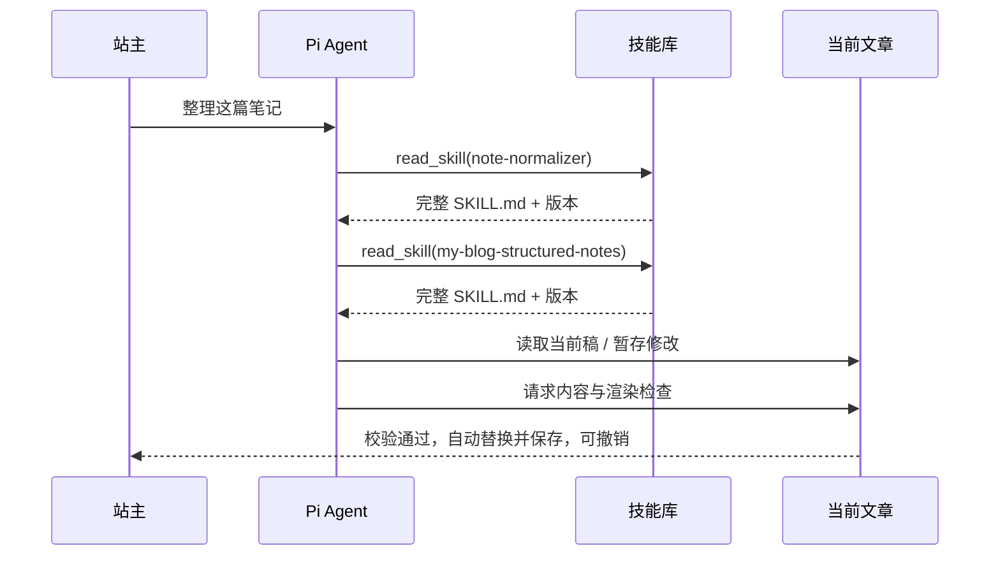

# 两个 Skill 的接入与维护规范

日期：2026-10-08。依据站主追加要求：按 Agent/Harness 的方式发现并读取技能，后续直接修改技能文件即可更新行为。

## 1. 接入结论

保留真实技能文件，不把 `note-normalizer` 与 `my-blog-structured-notes` 编译成固定的整理函数或提示词常量。

采用技能包形式：`技能名/SKILL.md`，可附 `references/` 和 `assets/`。这与 Agent Skills 的文件结构一致；技能的实际存储由站点统一接口提供。[Agent Skills 规范](https://agentskills.io/specification)

Pi Coding Agent 自带技能发现机制；本项目采用更轻量的 Pi Agent Core，所以需要自行提供注册器及 `read_skill` 工具，不能误以为安装 Pi AI 就会自动扫描技能。[Pi 技能机制](https://github.com/earendil-works/pi/blob/main/packages/coding-agent/docs/skills.md)

## 2. 初始来源与文件形态

初始导入来源：

- `C:/Users/a3129/.agents/skills/note-normalizer/SKILL.md`
- `C:/Users/a3129/.agents/skills/my-blog-structured-notes/SKILL.md`

本次检查两个源目录都只有 `SKILL.md`。结构化笔记技能还引用项目语法手册及本机诊断脚本，导入时要登记这些引用，并提供站内等价资源/检查工具。

建议默认资源形态：

```text
src/ai/skills/
├── note-normalizer/
│   └── SKILL.md
└── my-blog-structured-notes/
    ├── SKILL.md
    └── references/
        └── markdown-syntax.md
```

默认包保留原始规则，首装时进入技能版本库。导入说明记录源路径、时间和包指纹。运行时从当前有效版本读取；新安装才能使用默认包初始化，不能每次重启覆盖站主修改。

站内「原始文件编辑器」展示实际生效的完整文件，而不是展示一个人工压缩版摘要。第一版同时提供本机目录挂载和站内管理两种来源；每个技能只选择一个有效来源。

桌面挂载 `C:/Users/a3129/.agents/skills` 后，仅登记这两个技能目录，AI 直接读取原文件。每次新任务重读文件并计算指纹，不需要重启桌面版；当前任务仍固定原版本。挂载文件在站内只读，你可以在原目录编辑它们；若希望从网站设置编辑，则选择「导入站内管理」。目录不存在、文件无法读取或格式不合法时显示错误，不能用旧缓存假装已读取新规则。

网页端使用站内管理；本机绝对路径不上传或同步。管理模式导出的技能包仍可以放回 `.agents/skills` 使用，挂载模式不会偷偷覆盖该目录的文件。

## 3. 按需加载流程



1. 新任务首先获取启用技能的名称、描述和版本，避免每次闲聊都发送两个完整文件。
2. 匹配任务后调用 `read_skill`，加载完整正文并保留在当前任务上下文。
3. `note-normalizer` 根据笔记类型路由；需要结构化笔记时，必须继续加载第二个文件。
4. 用户显式指定技能时，运行时在首次生成请求前确定性加载该技能；不能完全依赖模型是否记得调用工具。
5. 自动选择时由模型调用加载工具；如果准备按结构化笔记规范写入却未加载第二个技能，工具前置检查返回缺少技能，要求先读。
6. 模型可调用 `read_skill_resource` 获取该技能已登记的模板或语法参考。
7. 加载结果不只给模型看，UI 同时显示技能名与版本，修改记录也保留它们。

技能不只是供阅读的一段文本：它参与任务路由、输出规范、工具执行前置条件和结果校验。模型服从规范仍依赖其能力，文件加载不能保证所有语义要求都被正确完成。

## 4. 后续修改怎么生效

站主打开「设置 → AI 助手 → 技能」，选择技能并编辑完整 `SKILL.md`，点击保存。

- 校验 YAML 的 `name`、`description`、文件大小和资源引用。
- 生成一个新版本，保留旧文件内容。
- 新任务发现并加载新版本；不需要重新打包应用。
- 旧任务继续使用它已经绑定的版本，同一任务不会一半新规则、一半旧规则。
- 点「恢复版本」切换有效版本；点「导出」得到可放回 Agent 的原始技能包。

技能管理展示两个层次：列表展示名称、说明、状态、版本；详情展示完整源文件与关联资源。源码编辑沿用现有设置风格，但 YAML/Markdown 技能文件使用源码模式，避免可视化编辑丢失 frontmatter。

因此，你可以按使用方式维护：常在 Codex 中修改这两个技能，就让桌面博客挂载同一目录；希望在网页中维护并在多设备使用，就选择站内管理。两种模式都执行真实文件内容，区别仅在文件来源；切换来源是显式操作。

## 5. 技能要求与站内工具的映射

| 原技能要求 | 站内实现 |
| --- | --- |
| `AskUserQuestion` | `ask_user` 在同一聊天框提问，保存任务状态后结束本次请求 |
| 调用另一个 Skill | `read_skill` 加载关联技能，保留加载记录 |
| 阅读 Markdown 语法手册 | `read_skill_resource` 读取同版本的登记资源 |
| `.diag` 文件交付 | 暂存候选 Markdown，最终更新当前文章 |
| 跑脚本自检 | `validate_markdown` 的既有程序化检查；不授权模型执行任意脚本 |
| 调用发布脚本 | 当前文章正文保存；发布状态仍由用户原有流程管理 |
| 本机绝对路径 | 导入/挂载配置由站主指定；模型通过技能 ID 与已登记资源访问，不自行打开任意绝对路径 |

这是运行环境适配，不是把格式规则转换成代码。技能文件中的模板、强度分级、内容保全和整理说明继续由文件定义。

主系统约定向模型声明可用工具和站内环境，技能不能增加未注册能力。不存在的 shell 指令不执行；模型应改用相应站内工具。

原文件引用 `docs/Markdown-语法手册.md` 时，由注册器提供该资源的明确映射，不要求模型凭本机路径猜测文件。资源映射只覆盖登记的语法参考，诊断命令映射为检查工具；这样挂载原技能也能在站内工作。

## 6. 已发现的原技能维护项

以下是原始文件中真实存在的冲突/历史信息，开发前要列出修改建议与对比，不默默改掉站主的模板：

1. §2.2 要求知识卡默认 `+` 展开，§8.1 示例仍有无折叠标记的知识卡。
2. §9.3 使用题干在标题行、整卡收起的单卡格式；§9.7 自检却描述题干不折叠、解析折叠的双卡结构。
3. §3.5 明确禁止参数前置高亮，后续「正确写法」示例仍出现同类写法。
4. 裸花括号和部分嵌套语法的历史限制需要对照当前 `mdx.ts`、`mdx-plugins.ts` 更新，不能把过去的 bug 当成永久规范。
5. 脚本路径、shell 命令和「构建卡死」属于原环境记录，应通过环境映射处理，不成为站内 AI 的操作命令。

站内版本可增加「兼容问题」提示和规范修订记录。遇到无法判定的模板冲突时通过聊天澄清，而不是让模型随意选一个规则完成后直接覆盖。

## 7. 长技能与费用

结构化笔记技能较长。第一版完整读取实际 `SKILL.md`，不为了省 tokens 静默裁剪后半部分。

后续可按标准结构将完整模板和排错手册移到 `references/`，主文件保留路由、硬规则及资源引用；模型依然通过工具读取真实文件。这需要一次明确的技能文件重构，确保规则无丢失，而不是由开发代码自动摘要。

同一任务按包指纹去重，已读过的同一版本不重复追加。切换文章时结束编辑上下文，避免把上一篇全文无意义地带入新任务。

## 8. 文件加载边界

仅站主能够导入、修改和启停技能。`read_skill_resource` 只接受已注册资源的相对路径，拒绝绝对路径、`..` 越界及未登记文件。文章正文和检索资料当作内容数据，不允许通过其中的指令改写技能或操作站点配置。

没有自动安装 npm 包、执行技能脚本或联网下载技能的功能。本次首批两个技能由站主提供，并使用有限工具完成文章编辑任务。

