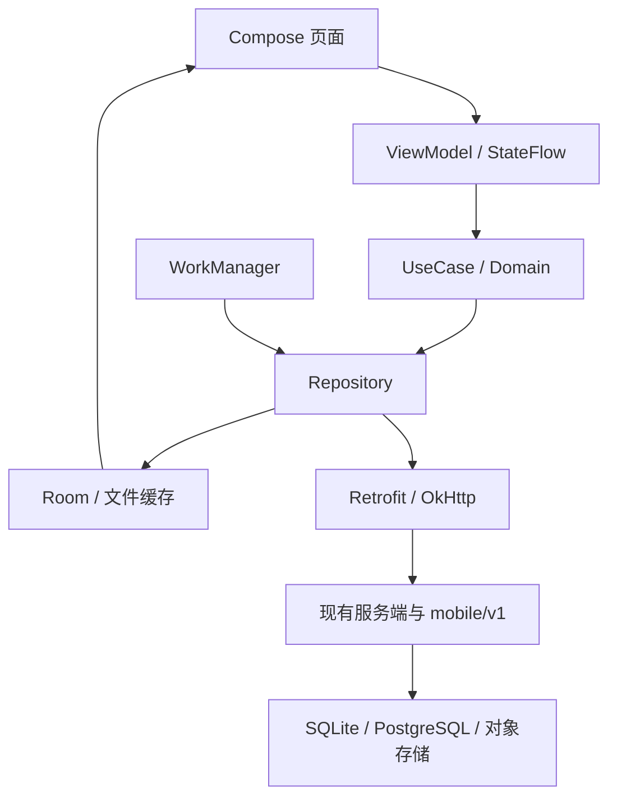

# 原生架构、接口、缓存与设计系统

## 依赖与模块

版本唯一来源为 `android-native/gradle/libs.versions.toml`；Gradle Wrapper 9.6.0 附官方 SHA256。使用 AGP 9.4 内置 Kotlin，不重复应用 kotlin-android 插件；Compose 编译插件 2.4.20。Java 执行环境复用本机 JDK 21，源码和 JVM 字节码目标 17。compileSdk/targetSdk 37，minSdk 24。API 37 平台官方包名为 `platforms;android-37.0`。

| 模块 | 第1阶段职责 |
|---|---|
| app | Activity、ViewModel、生命周期、导航装配、系统栏、减少动效监测 |
| core:model | 主题模型、阶段与模块清单，不含网络 DTO |
| core:designsystem | Material 3 Token、原生主题、硬阴影卡片、矢量图标 |
| core:preferences | DataStore 本机外观配置，不存服务会话或业务资料 |
| feature:foundation | 首页、模块交付说明、外观设置、组件体验室 |

后续 core:database/network/sync/rendering 和各业务 feature 按阶段加入；依赖从 UI 向领域/Repository，禁止页面直连数据库或网络。

第2阶段已加入core:network（Retrofit/OkHttp/Serialization DTO）、core:identity（Repository/Keystore/原子文件）和feature:connection（Compose连接表单）；OwnerConnectionRepository在core:model定义，不暴露口令或令牌给UI。ConnectionViewModel通过StateFlow驱动原生页，生命周期与网络变化触发串行校验。服务契约详见06-阶段2实施与契约。

第1阶段已实现 StateFlow + DataStore 的外观数据流。Room、Retrofit、Hilt、Coil、WorkManager 版本已登记，未声称这些未来业务模块已实现。

Material3 1.4.0 的 MotionScheme 在当前 BOM 中不是公开接口；减少动效通过 App 内 MotionDurationScale 统一控制，包括 Material 面板。WindowRecomposerPolicy 的版本相关适配隔离在 NativeApplication，显式 opt-in；升级 Compose BOM 时必须复查该适配与真机测试，不修改手机全局动画设置。

## 身份与公共契约（阶段2起实施）

- `/api/mobile/v1/auth/*`：仅站主口令绑定、身份探测、刷新撤销。定义 MobileSession，包含站主身份、有效期和权限；Bearer 会话映射现有服务端站主守卫，不改变 Web Cookie 调用契约。服务端刷新凭据哈希存储并轮换。
- `/api/mobile/v1/sync`：SyncEnvelope 包含协议版本、设备 ID、游标、幂等操作 ID、实体、基线版本、payload 或删除墓碑。响应 ack、changes、conflicts、cursor。权限在服务端执行，客户端不得直连云数据库。
- DocumentAstV1：版本、原文哈希、节点 ID、源码范围、组件类型、属性、子节点、目录与资源引用。使用现有 renderMdx 语义基准，不嵌入 HTML 网页。
- Web/桌面写入同样纳入版本和变更日志，避免旧 LWW 覆盖手机；Cadence 继续专用 CAS，不重复交给通用同步引擎。
- 新增数据库表同时维护两种 Drizzle 方言和同步注册。私人接口保留站主校验及 `private, no-store`。

首次需在线绑定，之后离线访问已有资料并编辑；会话失效仅暂停同步，保留受保护草稿。密钥、会话和敏感字段由 Android Keystore 加密。AI、OAuth、授权变更、运维、网盘远端操作需联网；恢复网络不自动执行高风险操作。

## 缓存与恢复（阶段3起实施）

| 数据 | TTL / 规则 |
|---|---|
| 列表分类导航公开统计 | 5 分钟 |
| 正文文档树相册元数据展示配置 | 1 小时 |
| 私人工作数据 | 持久 Room；本地事务 + outbox |
| 图片附件 | 资源版本缓存，用户下载固定保留 |
| 身份 | 服务端有效期，联网重新校验 |

UI 只订阅 Room Flow；冷启动写库后展示；TTL 内零请求；过期先读本地再后台刷新。空结果也缓存。失败显示缓存轻提示，无缓存可重试。刷新不覆盖待同步修改。冲突保留 base/local/remote，经用户选择后写入；幂等重试、删除墓碑。WorkManager 根据联网、修改与手动同步运行并退避。清缓存不能删除草稿、已下载资料或待上传附件。数据库升级写显式 Migration，不使用破坏性重建。

第4阶段加入`:core:document`与`:feature:reading`。前者定义DocumentAstV1、源码范围、稳定节点、目录、资源与未适配记录，并实现CommonMark与项目指令语义；后者实现阅读Repository、Compose渲染器、JLatexMath Android Canvas公式、原生图片预览及SAF导出。阅读DTO位于core:network，通过身份Repository受控调用站主接口；界面订阅加密Room缓存，不直接持有Bearer。

Room升至v2，新增`reading_cache`和`reading_positions`，显式Migration保留原notes/outbox/conflicts。目录和正文按serverId隔离；图片使用私有目录AtomicFile加密文件，避免将大图片放进Room CursorWindow。列表与搜索5分钟、展示配置与正文1小时；图片缓存按URL版本和TTL更新。搜索不包含未解锁私人正文；已解锁且缓存的正文可在本地搜索。点赞和阅读计数需联网，断网后不排队重放。

## UI Token

Material 3 交互骨架，Flat + Neubrutalism 皮肤。浅色 `#FAF8F4/#171717`，深色 `#171717/#F5F2EA`，强调黄 `#FFD43B`、青 `#4DD4C6`、紫 `#B9A4FF`。语义色统一由 ColorScheme 读取，动态取色可选（Android 12+），默认品牌色。

正文 16sp/26sp，标题 24–32sp，系统中文字体；间距 4/8/12/16/24/32dp，控件/卡片/面板圆角 12/16/24dp，描边 2–3dp，硬阴影偏移 3dp 无模糊，触控至少 48dp。长文字换行，不固定文字容器高度。宽公式、表格和代码局部横向滚动。

底部固定首页/文档/日历/日程/我的。右键映射长按；目录保持右侧浮层；编辑菜单映射键盘上方工具栏和 BottomSheet；文档树使用面包屑与长按排序；外链系统浏览器，文件通过 SAF 与分享。主题配置重启生效，恢复时读取 DataStore 不重置。

## 动效清单

| 类型 | 场景 / 时长 | 实现 / 阶段 |
|---|---|---|
| 缓动 | 按压/返回 120–300ms | tween/spring，阶段1基础 |
| 视差 | 首页/相册滚动约8% | graphicsLayer，阶段15 |
| 偏移延迟 | 列表220ms，间隔50ms，总≤500ms | animateItem，阶段4/15 |
| 遮罩 | 主题/图片350–450ms | Path/clipPath，阶段15 |
| 数值 | 统计900ms | Animatable，阶段10/15 |
| 父子级 | 卡片按压120–220ms | 分层变换，阶段1基础 |
| 叠加 | 弹窗/面板180–280ms | Material组件/AnimatedVisibility，阶段1基础 |
| 形态 | 图标180–240ms | graphics-shapes，阶段15 |
| 滑动缩放 | 页面250–320ms | Navigation/共享转场，阶段1基础、15增强 |
| 克隆 | 加入每日计划420ms | Overlay/路径Animatable，阶段9/15 |
| 3D | 图片/卡片280–400ms | rotationX/Y/cameraDistance，阶段15 |
| 综合 | 卡片详情320–450ms | SharedTransitionLayout，阶段15 |

参考 https://github.com/feitangyuan/motion-web#chinese 的输入响应、阻尼和收敛原则；不将 Web 技术嵌入 App。支持连续输入与取消。App 减少动效、系统动画倍率0、系统省电模式均使自定义动效直接切终态；Material 组件遵守系统动画倍率，App 减少动效也应覆盖其动画。

## 验证边界

第3阶段新增`:core:database`、`:core:sync`、`:feature:notes`。Room实体、网络DTO与Domain模型独立；Java Room注解处理器生成DAO实现，Kotlin Repository通过Room Flow驱动界面。私人正文、草稿、outbox和冲突副本使用Keystore AES-GCM加密，serverId隔离数据；普通浏览只订阅本地库。`NotesViewModel`顺序处理输入事件，保存等待此前草稿写入完成；打开编辑器先冻结基线，防止后台刷新改变正在编辑的版本。WorkManager仅负责联网约束下的同步及指数退避，详见`08-阶段3实施与契约.md`。

阶段1在用户更换后的 Redmi K30（Android12/API32，1080×2400）运行4项自动验收，全部通过。原 Android16/API36 手机未完成验收。API24、API36、API37和无障碍完整人工验收待后续兼容检查及阶段16。最终关键动效 P95≤16.7ms、超预算帧≤5%，必须用 release/profileable 实测，不能由 debug 观感推定。
