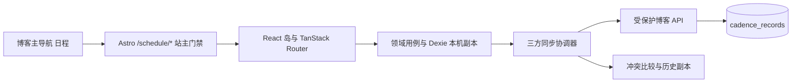

# Cadence 整合技术文档

| 项       | 内容                                                                                                |
| -------- | --------------------------------------------------------------------------------------------------- |
| 更新日期 | 2026-09-30                                                                                          |
| 状态     | 已形成实现，编译结果与交互验收分别记录于开发文档                                                    |
| 技术栈   | Astro SSR、React 19、TanStack Router、Dexie、Zustand、Zod 4、Motion、Tailwind 4、SQLite/PostgreSQL  |
| 关联文档 | [需求文档](./cadence-integration-requirements.md)、[开发文档](./cadence-integration-development.md) |

## 1. 源码调研与迁移边界

Cadence 是 React/Vite SPA，按 `entities / features / widgets / pages` 分层。实际源码已经具备长期计划与三层任务树、每日计划、15 分钟日程时间轴、执行记录、周期复盘、XY 待办、统计、倒计时，以及本地规则助手。Dexie repository 提供响应式本地存储，UI 与助手复用 feature usecase。

原需求文档中的能力不能全部视为现成实现：原设置页含复盘周期、XY 配置和数据管理占位；原执行只有开始与结束；导入把合并后的整表行数与文件记录数比较，可能已写入却报告失败。此次接入补齐设置、暂停/继续、手动补录、回收站恢复、导入预览、快照与 CSV 导出。

代码置于 `src/cadence/`，保留原领域结构。没有引入原 Vite 入口、Tauri/Capacitor 壳、全局 CSS reset、纸纹资源或独立主题。原源码没有独立授权文件，项目来源保留在本文件与需求文档中。

## 2. 页面与视觉方案

| 外部路径             | 内容                             |
| -------------------- | -------------------------------- |
| `/schedule`          | 总览、倒计时、今日计划           |
| `/schedule/plans`    | 长期计划与任务树                 |
| `/schedule/schedule` | 每日时间日程                     |
| `/schedule/execute`  | 执行计时与补录                   |
| `/schedule/review`   | 周期复盘与历史内容               |
| `/schedule/todos`    | XY 看板与列表                    |
| `/schedule/stats`    | 统计                             |
| `/schedule/settings` | 同步、周期、坐标、数据、助手设置 |

- `src/pages/schedule/[...path].astro` 承接内部路径刷新，服务端先校验站主，再渲染 `CadenceRoot`。
- TanStack Router 的 `basepath` 是 `/schedule`，页面按路由懒加载。博客 `BaseLayout` 保留唯一全局导航，Cadence 外壳提供左侧功能导航和窄屏抽屉。
- `src/styles/cadence-tokens.css` 是博客主题语义变量的映射，由全局 Tailwind 编译。`src/cadence/styles/blog.css` 只提供 `.cadence-root` 内的表面、焦点、数字和布局样式。
- 颜色、字体、明暗模式、圆角与图表色均引用博客变量。输入框与按钮采用博客的边框、背景和强调色，取消手绘波纹、卡片倾斜与纸纹。
- 日程助手在此区域常驻；博客阅读助手在日程路径不挂载，以免两个助手重叠。日程动效支持强度开关和系统 reduced-motion。

### 区域布局实现

`AppShell` 在 1024px 起使用 152px 侧栏加 `minmax(0,1fr)` 正文，侧栏 sticky 停靠于全局页头下方。窄屏抽屉采用项目 Dialog 基础组件，提供焦点约束、Esc、遮罩关闭与焦点恢复；路由变化关闭抽屉。

总览容器启用 CSS container query。方卡网格按容器的 460/700px 阈值切换列数，列宽最大 280px；卡片 `aspect-ratio:1`，内部采用纵向 flex，内容区 `min-height:0; overflow-y:auto`，固定操作区不参与滚动。倒计时管理对话框与滚动内容区分开，避免弹窗被裁切。布局样式限定在 `.cadence-root`，沿用博客主题变量。无需修改 API、SQL 或 IndexedDB schema。

## 3. 鉴权与隐私

**站主判断使用 `getAdminIdentity(cookies).kind === 'top'`。** 不能仅用 `isTopAdmin`：现有权限体系允许委派管理员获得 top 角色，但其身份仍属于 GitHub 管理员，不能因此读取站主私人日程。

- 页面与两个 API 均独立验证站主；`/api/cadence/*` 同时登记到既有 API 权限守卫。
- 页面/API 使用 `Cache-Control: private, no-store`，页面禁止索引。
- 写接口检查请求 Origin、版本、大小、表白名单、ID 一致性、字段结构及关键业务约束。
- 浏览器业务代码不导入 Drizzle、Node crypto、数据库驱动或 AI 密钥。
- 本机 IndexedDB 是该浏览器或桌面端用户配置的私人副本；清除网站数据会清除它。同步基线、冲突历史与导入前快照属于当前设备，不包含在普通业务 JSON 导出中；冲突历史提供单独下载入口。

## 4. 存储方案与设计调整

### 4.1 本机副本

数据库名为 `byqx-cadence`，与源项目的 `cadence` 隔离。11 张业务表保持原字段语义：

`plans / tasks / sessions / reviewSchedules / reviewEntries / todos / axisConfigs / dailyPlans / scheduleEvents / countdowns / settings`。

本机 Dexie 版本 2 新增 `_syncBase / _syncConflicts / _syncPending`；业务备份格式仍为 `cadence-export`、`schemaVersion: 1`。新增会话 `pausedAt`、`pausedMs` 是可选字段，旧备份可导入；导出时保留这些字段。

### 4.2 服务端

最终实现采用一张 **`cadence_records` 实体封装表**，代替初稿中按业务实体分别新建 SQL 表的方案。业务数据仍经过各实体 Zod 校验，服务端保存完整 JSON，避免 Dexie 数据到双数据库的重复字段转换。

| 字段         | 类型/语义                               |
| ------------ | --------------------------------------- |
| `id`         | `${kind}:${record_id}`，主键            |
| `kind`       | 11 种业务表白名单之一                   |
| `record_id`  | 原实体 ID；settings 使用 key            |
| `payload`    | JSON 文本；NULL 为硬删除墓碑            |
| `revision`   | 服务端 UUID 版本令牌                    |
| `updated_at` | 服务端 ISO 时间，仅用于管理，不裁决冲突 |

两份 Drizzle schema 均登记该表。PostgreSQL 新增 `0017_cadence_records.sql`、journal 和 snapshot；SQLite API 首次访问时只执行新增表的 `CREATE TABLE IF NOT EXISTS`，不推送或重建既有博客 schema。

`src/lib/cadence-store.ts` 提供 SQLite 与 PostgreSQL 适配器：SQLite 用 immediate transaction；PostgreSQL 用 transaction + advisory transaction lock。锁同时保护版本检查、单活动计时器和日程重叠等全局约束。

桌面端配置 `SYNC_DATABASE_URL` 时，日程 API 直接以该云库作为跨设备端点；断网时 Dexie 保留读写。`cadence_records` 在旧 SQLite↔PostgreSQL 同步框架中登记为跳过，避免旧 LWW 策略与新三方同步同时裁决同一批数据。未配置云端时，桌面/开发 SQLite 只作为当前服务的同步端点。

## 5. 同步协议

### 5.1 API 契约

- `GET /api/cadence/sync` → `{ schemaVersion: 1, records: RemoteRecord[] }`。
- `POST /api/cadence/sync` → `{ schemaVersion: 1, changes: SyncChange[] }`，每次最多 250 条、4 MB。
- 每个 change 包含 `table / recordId / payload / baseRevision`；返回 `{ records, conflicts }`。
- `records` 为接受或幂等确认的版本；`conflicts` 为版本不匹配时的当前远端记录。
- 初次同步先展示本地、远端条数。确认连接后合并，默认不以空副本覆盖任一侧。

本期采用全量读取远端元数据与内容、逐实体 UUID 版本检查，不使用初稿的 deviceId、增量 cursor 或 batchId。相同业务内容的重复请求返回原 revision，解决响应丢失后的幂等重试。客户端每批发送 200 条；批次之间的基线按已确认记录独立推进。

### 5.2 三方比较

`canonicalContent` 稳定排序 JSON 对象键，忽略根层 `createdAt / updatedAt`，保留数组顺序与其他业务字段。设备初始化时间不同不会使同一默认轴产生假冲突。

| 相对共同基线   | 行为                               |
| -------------- | ---------------------------------- |
| 本地与远端相同 | 更新版本基线                       |
| 只有本地变化   | push，附远端版本令牌               |
| 只有远端变化   | pull；写入前再次确认本地未被编辑   |
| 双方变化且不同 | 保留基线、本地、远端，等待站主选择 |

服务端在事务内做 CAS。网络返回时客户端再次核对本地内容，不覆盖请求期间的新编辑。同源标签优先用 Web Locks 串行同步；跨设备由服务端事务和 revision 防护。

- 冲突记录暂停自动覆盖，其他记录继续同步；用户选本地/远端时再次检查远端版本。
- 解决后的双方副本保留，可下载、查看或恢复为新的本地编辑。恢复前保留当前内容，并重新校验本地业务约束。
- 硬删除保留服务端墓碑，本期不自动清理墓碑。已同步实体在服务端突然消失，视为换库/重置，转为冲突而不是自动删除本机内容。
- 本机改动防抖 1.8 秒后同步；启用状态下每 30 秒检查，联网事件触发重试。离开 React 岛清理监听和计时器；设置中可暂停同步。
- 日程重叠、多个活动会话、不同 ID 占用同一复盘格等跨实体约束冲突会拒绝批次并显示原因，保留本地内容，需先调整业务记录；它们不等同于同 ID 的版本选择冲突。

## 6. 执行与复盘

- 开始、暂停/继续、结束使用本机事务读取最新会话，防止同设备多标签同时创建活动会话。
- 有效时长 = `(endedAt ?? pausedAt ?? now) - startedAt - pausedMs`，不依赖 interval 累加。全局计时提示、执行页、统计和助手播报使用相同计算函数。
- 手动补录拒绝反向/未来时间、超过 24 小时或与已有记录相交的时间段。
- 原会话区间查询会漏掉跨多日的活动会话，已调整为按开始时间粗筛后判断相交。
- 周期格仍由 interval、anchor、date 和时区派生。历史列表独立展示已保存条目，改周期或停用后不删除正文。
- 新复盘条目 ID 由周期和起点确定；已删除格子重写时复用原条目 ID，兼容 Dexie 复合唯一键。

## 7. 数据导入导出与恢复

- JSON 保留原 11 张业务表；CSV 提供执行与复盘记录，并对电子表格公式前缀做转义。
- 导入先解析版本和 Zod 结构，显示各表数量、重复 ID 数量及处理策略；默认跳过重复，可明确选择覆盖。
- 在包含全部业务表与 snapshots 的单个 Dexie 事务内读取当前备份、构造合并结果、校验引用及业务约束、存入导入前快照、执行写入。任一步失败整体回滚。
- 导入后不再将整表总行数等同于文件行数，不强制刷新页面；响应式查询呈现结果。
- 回收站恢复任务时恢复必要的父任务与计划；清空需确认。启动时清理软删除超过 30 天的业务记录；同步墓碑与冲突副本不参与该清理。

## 8. 助手接入

高频指令优先本地规则解析。开启智能理解后，未命中的语句通过 `POST /api/cadence/assistant` 使用博客服务端 AI 配置。

- 客户端只持久化是否启用；地址、模型和密钥不作为日程前端配置保存。
- 工具参数通过 Zod 4 `toJSONSchema` 生成 JSON Schema，修复原代码使用旧 `_def.typeName` 的兼容问题。
- 服务端限制工具名白名单、文本/请求大小，要求一次最多一个 tool call；模型只生成操作建议，不执行数据库操作。
- 客户端继续校验参数、唯一匹配与破坏性确认，再调用原 feature usecase；服务端同步也验证业务约束。
- 上游不可用时回退本地规则，不能通过模型回答虚报操作成功。

## 9. 限制与发布边界

本期未实现网页离线冷启动的 Service Worker；已打开的网页和本地桌面服务可以离线使用副本。全量同步适合个人数据规模，超大数据集以后再扩展分页与增量游标。冲突历史只在检测它的设备保存，清除网站数据前应单独下载。

生产 PostgreSQL 迁移、真实双设备交互、浏览器视觉与现有日历回归尚需专门验收。构建和类型检查不能代替这些结论；开发文档记录实际命令及边界。
